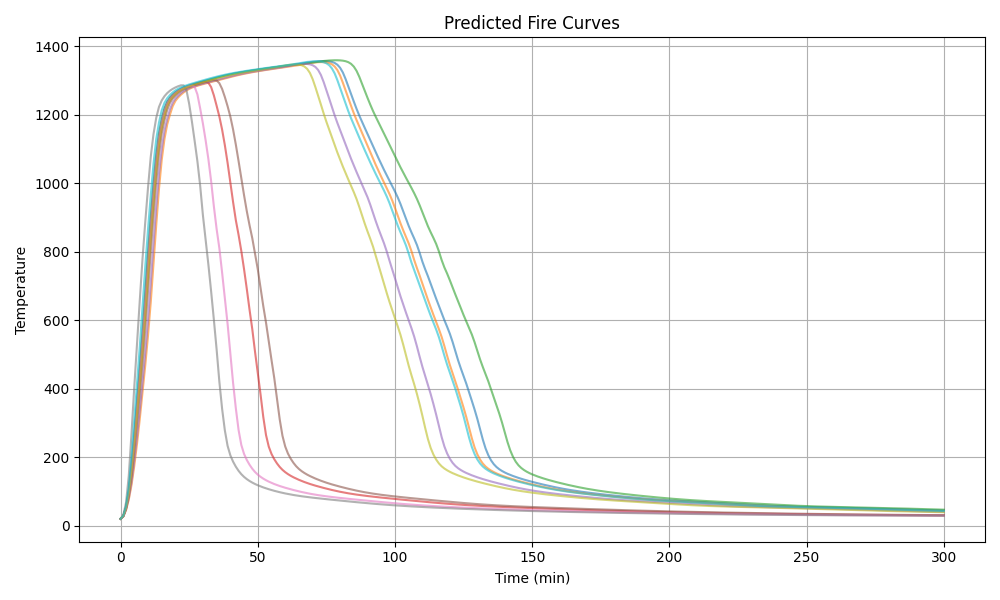

# Compartment_fire_predictor

This program is based on the paper '_Implementation of LSTM Network for Temperature-time Curve Prediction of Mass Timber Compartment Fire_', Tongchen Han and Solomon Tesfamariam.


The compartment fire predictor is to generate timber compartment fires, developed based on the long short-term memory network and one-zone model [1]. The predictor considers inputs of **fire load density**, **opening factor**, **fire growth rate**, and **Exposed timber surface area** for one designed compartment. The user is allowed to define the **compartment length, width, and height**. 

## 📌 Usage

The compartment fire predictor can be download from this repository.
```bash
git clone https://github.com/Heartouchan/Compartment_fire_predictor.git
```

Change directory to the program,
```bash
cd Fire_curve_predictor\Program
```

Install necessary pacakages listed from requirement.txt,
```bash
pip install -r requirements.txt
```
Simply, the user can run the _run_fire_predidctor.bat_ to complete the installation of required packages.

Run the program.py and provide input csv file. The input file should include fire load density (first column), fire growth rate (second column), the opening factor (third column), and exposed surface area (fourth column). For instance,
```bash
Input file path (C1: Fire load density (MJ/m²); C2: Fire growth rate (s); C3: Opening factor; C4: Exposed surface area (m2)): Input.csv
Compartment length (m): 5
Compartment width (m): 5
Compartment height (m): 3
```

The predictor is able to generate a group of fires. And the fire temperature file is produced once the calculation finished.
<p align="center">
  
  <br>
  <em>Example of generated fire curves</em>
</p>

Please contact touch01@student.ubc.ca for any problem, suggestion, and recommedation.


## 📚 References
[1] Cadorin, J. F., Pintea, D., & Franssen, J. M. (2001). The design fire tool OZone V2. 0-Theoretical description and validation on experimental fire tests. Rapport interne SPEC/2001_01 University of Liege.
